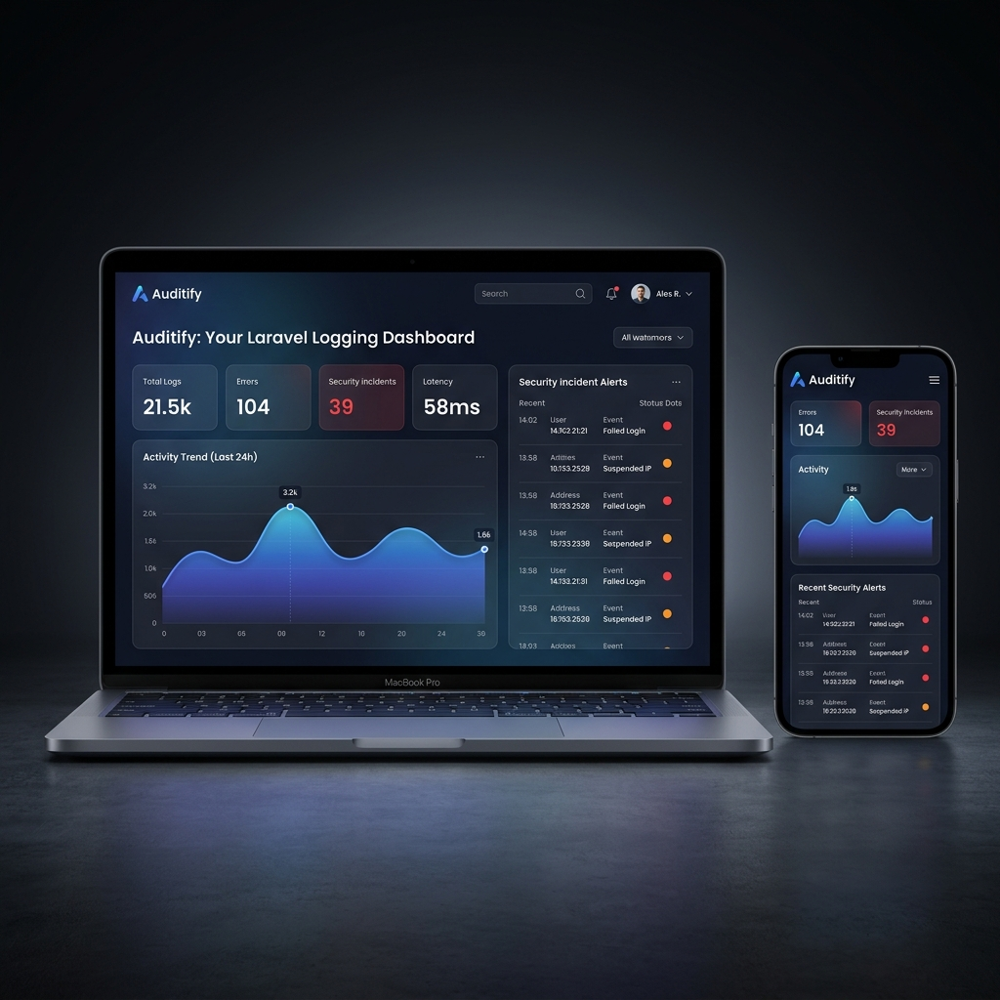

# Auditify — Simple, High-Performance Audit Logging for Laravel

<p align="center">
  
</p>

[](https://packagist.org/packages/arpanihan/auditify)
[](https://packagist.org/packages/arpanihan/auditify)
[](LICENSE.md)

**Auditify** is an easy-to-use, high-performance audit logging and threat detection package for Laravel. 

Unlike other packages that dump every single event into one massive, slow database table, Auditify uses a **decoupled database design**. It splits your logs into three separate tables (Action, Activity, and Security). This keeps your database quick, reduces write congestion, and makes logs easy to search.

It also includes an **XSS Attack Shield** to block malicious requests, automatic detection for suspicious activity (like bulk updates or mass deletions), queued email alerts, and a beautiful responsive admin dashboard.

---

## Table of Contents
1. [Key Features](#key-features)
2. [Quick Start (3-Minute Setup)](#1-quick-start-3-minute-setup)
3. [Decoupled Logging Architecture](#2-decoupled-logging-architecture)
4. [Step-by-Step Installation](#3-step-by-step-installation)
5. [Basic Usage & Code Examples](#4-basic-usage--code-examples)
6. [Advanced Features](#5-advanced-features)
7. [Artisan Commands & Maintenance](#6-artisan-commands--maintenance)
8. [Configuration Reference](#7-configuration-reference)
9. [Troubleshooting & FAQs](#8-troubleshooting--faqs)
10. [Best Practices & Performance](#9-best-practices--performance)
11. [Contributing & License](#contributing--license)

---

## Key Features

*   **Three Separate Log Tables**: Action, Activity, and Security logs are kept apart for maximum performance.
*   **Automatic Model Auditing**: Tracks database changes (`created`, `updated`, `deleted`, `restored`) showing exact old and new values.
*   **XSS Attack Shield**: Middleware scans request parameters and route variables, logs critical threats, and blocks malicious requests.
*   **Suspicious Activity Rules**: Automatically flags mass updates, rapid deletions, and login brute-force attacks.
*   **Asynchronous Email Alerts**: Queue-backed notifications warn administrators about high-severity security incidents.
*   **Multi-User & Multi-Guard Support**: Automatically associates events with whichever user model is logged in (e.g. `User`, `Admin`, `Customer`).
*   **Log Pruner Command**: Easy cleanup script with configurable retention periods to avoid database bloat.
*   **Modern Web Dashboard**: Glassmorphic UI featuring light/dark mode toggles, real-time Chart.js activity graphs, and CSV/Excel downloads.

---

## 1. Quick Start (3-Minute Setup)

Follow these simple steps to install and start using Auditify immediately.

### Step 1: Install the Package
Run this command in your project root:
```bash
composer require arpanihan/auditify
```

### Step 2: Run the Installer
Run the installation command to publish configuration files, copy migrations, and set up your database:
```bash
php artisan auditify:install
```

### Step 3: Add Trait to Your Models
Add the `Auditable` trait to any Eloquent model you want to track:
```php
namespace App\Models;

use Illuminate\Database\Eloquent\Model;
use Auditify\Traits\Auditable;

class Product extends Model
{
    use Auditable;
}
```
That's it! Any time a product is created, updated, or deleted, Auditify will automatically log the changes.

### Step 4: Open the Dashboard
Navigate to `http://your-app.test/auditify` in your browser to view your logs.

---

## 2. Decoupled Logging Architecture

Auditify divides data logs into three dedicated tables under `Auditify\Models` to avoid write bottlenecks:

### 1. Action Logs (`ActionLog`)
*   **Table Name**: `audit_action_logs`
*   **Purpose**: Logs database modifications.
*   **Saved Fields**: Model type, action (CREATE/UPDATE/DELETE/RESTORE), side-by-side attributes difference (`old_values` and `new_values` JSON structures), URL, user agent, IP address, and authenticated user.

### 2. Activity Logs (`ActivityLog`)
*   **Table Name**: `audit_activity_logs`
*   **Purpose**: Logs user interaction, navigation, and auth events.
*   **Saved Fields**: Auth status events (logins, logouts, login failures), visited pages, page request URLs, user agent, IP address, and user ID.

### 3. Security Logs (`SecurityLog`)
*   **Table Name**: `audit_security_logs`
*   **Purpose**: Logs security alerts triggered by the XSS firewall or threat engine.
*   **Saved Fields**: Alert title, threat severity (low, medium, high, critical), description, IP address, user agent, read status, and user ID.

---

## 3. Step-by-Step Installation

If you prefer to perform the setup steps manually instead of using the `auditify:install` shortcut:

### Step 1: Install via Composer
```bash
composer require arpanihan/auditify
```

### Step 2: Publish the Configuration File
```bash
php artisan vendor:publish --tag="auditify-config"
```
This copies the settings to `config/auditify.php`.

### Step 3: Publish the Migrations
```bash
php artisan vendor:publish --tag="auditify-migrations"
```
This publishes database files to `database/migrations/`.

### Step 4: Run Migrations
```bash
php artisan migrate
```

---

## 4. Basic Usage & Code Examples

### Manual Action Logging
Write to the action logs at any time using the `Auditify` Facade:
```php
use Auditify\Facades\Auditify;

Auditify::logAction(
    action: 'APPROVE',
    module: 'Invoice',
    description: 'Invoice #1042 approved by finance supervisor',
    oldValues: ['status' => 'pending'],
    newValues: ['status' => 'approved']
);
```

### Manual Activity Logging
Log page interactions or custom workflow milestones:
```php
use Auditify\Facades\Auditify;

Auditify::logActivity('Clicked checkout button');
```

### Manual Security Logging
Add custom threat logs to the system manually:
```php
use Auditify\Facades\Auditify;

Auditify::logSecurity(
    title: 'Unauthorized Access Attempt',
    description: 'User tried to load billing page without valid subscription',
    severity: 'medium'
);
```

---

## 5. Advanced Features

### Bypassing Auditing (Disable Logging Temporarily)
When running database seeders, importing large CSV files, or running heavy migration scripts, disable auditing to save time and performance. 

Use the `withoutAuditing` closure helper:
```php
use Auditify\Facades\Auditify;
use App\Models\Product;

Auditify::withoutAuditing(function () {
    // Audit logs will NOT be written for these operations
    Product::factory()->count(1000)->create();
});
```

Alternatively, toggle it manually:
```php
use Auditify\Facades\Auditify;

Auditify::disableAuditing();

// Perform operations here...

Auditify::enableAuditing();
```

### Tracking Custom Users and Guards
Auditify uses polymorphic relationships. It resolves whichever user is currently authenticated (regardless of the guard, such as `web`, `admin`, or `api`).

You can also log events for specific users manually:
```php
use Auditify\Facades\Auditify;
use App\Models\User;

$user = User::find(5);

Auditify::logActivity(
    activity: 'Updated profile settings',
    url: request()->fullUrl(),
    userId: $user // Pass the Eloquent model instance directly
);
```

You can also pass specific User ID and Model types as an array:
```php
Auditify::logActivity(
    activity: 'Admin action',
    url: request()->fullUrl(),
    userId: ['id' => 1, 'type' => \App\Models\Admin::class]
);
```

### XSS Attack Shield
Auditify has built-in XSS protection. It automatically scans all incoming request parameters (such as `$_GET` or `$_POST`) and route variables. 

If it detects common XSS patterns (like `<script>`, `javascript:`, or SVG events), it:
1. Logs a **critical** security log entry.
2. Returns an HTTP `403 Forbidden` response to block the request.

#### Excluding Routes
If you have pages that require rich text input (e.g. admin markdown or HTML editors), exclude them in your `config/auditify.php` file:
```php
'xss_protection' => [
    'enabled' => true,
    'block' => true,
    'exclude_routes' => [
        'admin/articles/*',
        'posts/*/edit',
    ],
],
```

### Real-Time Threat Engine
Auditify automatically monitors activity logs and logs high-priority Security entries when rules are broken:
*   **Mass Delete Shield**: Fires a `critical` security log if a user deletes 5 or more records (default) in a single model within 5 minutes.
*   **Bulk Update Shield**: Fires a `high` security log if a user updates 10 or more records (default) in a single model within 5 minutes.
*   **Failed Logins monitor**: Tracks failed logins. Fires a `high` security log if 3 or more failed login attempts are recorded within 5 minutes.
*   **Sensitive Module monitor**: Triggers a `medium` security log whenever models listed in `sensitive_modules` (e.g. `User`, `Role`, `Permission`, `Setting`, `Config`) are modified.
*   **Permission Changes**: Triggers a `high` security log whenever a permission, role, or gate mapping is added, modified, or deleted.

### Asynchronous Email Alerts
Auditify can send alerts to administrators when high or critical security alerts are logged. Because mail servers can be slow, these notifications implement Laravel's `ShouldQueue` contract.

#### 1. Setup in `config/auditify.php`
Enable alerts and define the administrator email addresses:
```php
'alerts' => [
    'enabled' => true,
    'recipients' => ['admin@example.com', 'security@example.com'],
    'channels' => ['mail', 'log'],
],
```

#### 2. Run your Queue Worker
Make sure you have a queue worker running on your server to send the emails:
```bash
php artisan queue:work
```

### Frontend Event Logging API
Track button clicks, mouse behaviors, or client-side Javascript actions by sending a POST request to `/auditify/api/events`.

```javascript
fetch('/auditify/api/events', {
    method: 'POST',
    headers: {
        'Content-Type': 'application/json',
        'X-CSRF-TOKEN': document.querySelector('meta[name="csrf-token"]').getAttribute('content')
    },
    body: JSON.stringify({
        event_name: 'File Download',
        description: 'User downloaded the User_Guide.pdf document'
    })
});
```

### Dashboard Custom Authorization Gate
By default, the Auditify dashboard uses your default web authentication and guards. To define custom access control, register an authorization callback in the `boot` method of your `AppServiceProvider`:

```php
namespace App\Providers;

use Illuminate\Support\ServiceProvider;
use Auditify\Facades\Auditify;

class AppServiceProvider extends ServiceProvider
{
    public function boot()
    {
        // Restrict dashboard to Super Admins only
        Auditify::auth(function ($request) {
            return $request->user() && $request->user()->hasRole('super-admin');
        });
    }
}
```

---

## 6. Artisan Commands & Maintenance

### Package Installer
Copy files and apply migrations:
```bash
php artisan auditify:install
```

### Pruning Historical Log Data
Log tables can grow large over time. Prevent performance issues by scheduling database cleanups. 

Run the pruning command manually:
```bash
php artisan auditify:prune --days=90
```

To automate this, register the command in your Laravel task scheduler. Open your console scheduling configuration (`routes/console.php` or `app/Console/Kernel.php`) and add:
```php
use Illuminate\Support\Facades\Schedule;

Schedule::command('auditify:prune --days=90')->daily();
```

---

## 7. Configuration Reference

The settings file is located at `config/auditify.php`. Here is an overview of the options:

| Option Key | Default | Description |
|---|---|---|
| `route_prefix` | `'auditify'` | The URL path prefix for accessing the log dashboard (e.g. `/auditify`). |
| `theme` | `'dark'` | Visual layout style theme: `'dark'` or `'light'`. |
| `middleware` | `['web']` | Middlware classes applied to dashboard routes. |
| `pagination` | `20` | Number of items shown per page in the log tables. |
| `track_ip` | `true` | Save client IP addresses with logs. |
| `track_user_agent`| `true` | Save client web browsers with logs. |
| `track_url` | `true` | Save request URL paths with logs. |
| `authorization.enabled`| `false` | When true, requires the gate authorization below to open the dashboard. |
| `authorization.gate`| `'view-auditify'`| Standard Laravel gate required to access the dashboard. |
| `track_auth_events`| `true` | Auto-log logins, logouts, and login failures. |
| `track_page_visits`| `true` | Auto-log GET page visits (ignores AJAX, PJAX, and Auditify dashboard routes). |
| `alerts.enabled` | `false` | Enable/disable admin notifications on high/critical security threats. |
| `alerts.recipients`| `['admin@example.com']` | Email addresses that receive alert notifications. |
| `alerts.channels` | `['mail', 'log']` | Notification delivery channels. |
| `alerts.sensitive_modules` | `['User', 'Role', 'Permission', 'Setting', 'Config']` | Models that trigger medium warnings when updated/deleted. |
| `xss_protection.enabled` | `true` | Turn request XSS scanning on or off. |
| `xss_protection.block` | `true` | Return HTTP 403 Forbidden to abort requests when XSS is found. |
| `xss_protection.exclude_routes` | `[]` | Routes to skip during XSS scans (supports wildcard paths like `admin/*`). |
| `pruning.keep_days`| `90` | Default age in days for keeping historical log rows. |

---

## 8. Troubleshooting & FAQs

### Q: The dashboard loads with a "403 Unauthorized Access" error page.
*   **Reason**: You have enabled authorization but the current logged-in user does not pass the gate checks.
*   **Solution**: Check your authorization settings in `config/auditify.php`. If `authorization.enabled` is `true`, make sure you define the gate in your service provider, or use `Auditify::auth()` in `AppServiceProvider` to explicitly approve users.

### Q: XSS attacks are block-triggering on normal user submissions (false positives).
*   **Reason**: Users are submitting text containing HTML tags or code snippets (e.g. rich-text blog post editors).
*   **Solution**: Exclude the route patterns in `config/auditify.php` under the `xss_protection.exclude_routes` setting.

### Q: Email alerts are not sending when critical warnings occur.
*   **Reason**: The queue worker is not running, or email settings in `.env` are misconfigured.
*   **Solution**:
    1. Verify that `'alerts.enabled'` is `true` in `config/auditify.php`.
    2. Check your `.env` file mail variables (`MAIL_HOST`, `MAIL_PORT`, etc.).
    3. Ensure you have run `php artisan queue:work` to execute queued emails.

### Q: Logs triggered in artisan console commands have empty user fields.
*   **Reason**: When running console seeders or queue jobs, there is no HTTP request session or logged-in user.
*   **Solution**: If you are logging manually, pass a user ID model instance explicitly: `Auditify::logActivity('System process complete', userId: $user)`. Otherwise, wrap background operations in `Auditify::withoutAuditing()` to skip console audits.

---

## 9. Best Practices & Performance

1.  **Always Use Queues for Alerts**: Sending emails during a web request slows down the user's experience. Make sure your `.env` queue driver is NOT set to `sync` (use `database`, `redis`, or `sqs` instead), and keep queue workers running in production.
2.  **Schedule Regular Pruning**: Audit logs grow rapidly on busy websites. Schedule `auditify:prune --days=90` to clean up tables automatically every day.
3.  **Disable Logs in Seeders**: If your seeders insert thousands of records, use `Auditify::withoutAuditing(...)` to prevent the tables from filling up with dummy logs and slowing down the process.
4.  **Tune Database Key Indexes**: If your logging tables become extremely large (millions of rows), consider adding custom indexes on the `user_id`/`user_type` columns or partitioning the table by months.

---

## Contributing

Please see [CONTRIBUTING.md](CONTRIBUTING.md) for details.

---

## License

The MIT License (MIT). Please see [License File](LICENSE.md) for more details.
